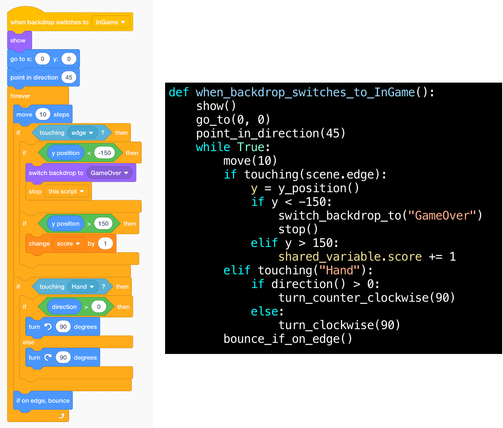

# Youpy

Youpy aims at smoothing Python learning curve for beginners with or without
knowledge of [Scratch](https://scratch.mit.edu/). It does this by
providing a simple game engine framework
and a front-end API as close as possible to Scratch.

Many beginners guide for Python only offers command line activities
based on the austere interface supported by the `input` and `print`
functions. On the contrary, Youpy brings a modern graphical API allowing
teachers to create rich recreational activities for educational purpose
accessible to student with no programming skills.

For instance, imagine a simple game represented by the following
screenshot, where
the player control the "Hand" sprite at the bottom of the stage to
catch the bouncing ball sprite. The player scores one point each time the
ball touches the top edge. The game is over when the ball touches the bottom
edge.

Look at this snippet of code from the "BasketBall" sprite, and see
how close is the Python code written using Youpy from its Scratch equivalent.

To summarize:
* Youpy's goals:
  - Make beginners enjoy programming in Python as much as in Scratch
  - Stick to plain Python code with less implicit magic possible.
* Youpy's explicit non-goals:
- No 3D: 2D is enough for beginners
- Fast rendering: we only need to handle a handful of a hundred
  sprites at most

## Table of contents

1. [Install/upgrade procedure](INSTALL.md)
1. [Youpy's project examples](EXAMPLES.md)
1. [Scratch functions implementation status](SCRATCH.md)
1. [Developers guide](HACKING.md)

## License

Youpy is released under the term of the [BSD 3-Clause license](LICENSE.txt)
Copyright (c) 2020, Nicolas Desprès
All rights reserved.

### Examples

The examples available in the `youpy/examples/` directory may be
distributed under different term. In such a case, a `LICENSE.txt` file
will be present at the root of the example directory.

The `<project>.sb3` files included in `youpy/examples/` are released under the
term of the `<project>/LICENSE.txt` if present or the term of
the [BSD 3-Clause license](LICENSE.txt) (where `<project>` may be one
of the example project name.
